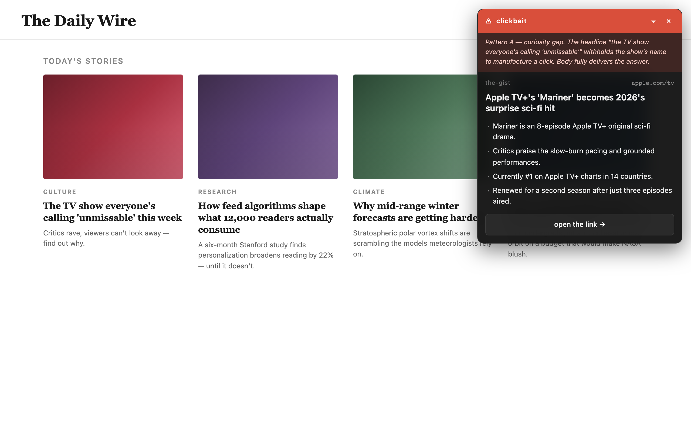
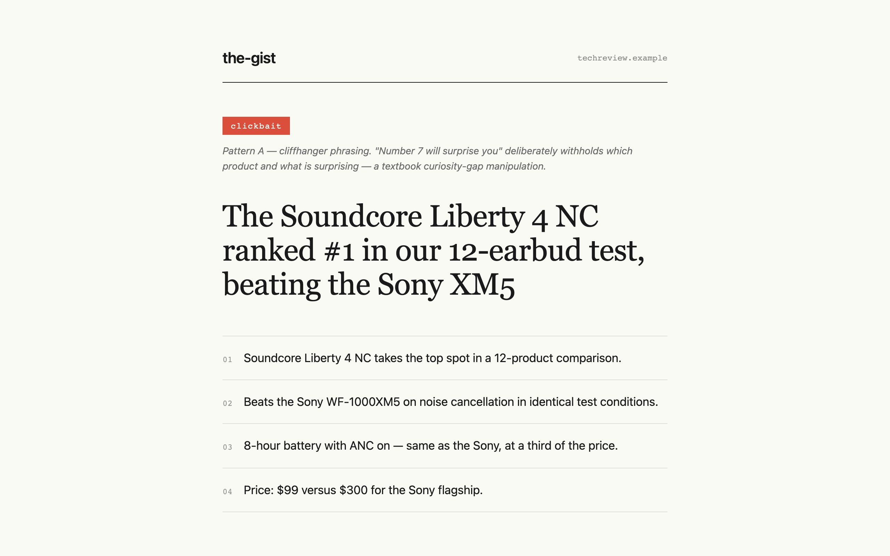

# the-gist

A Chrome extension that summarizes web pages into 3-5 bullets and flags clickbait — including the **gap between what a link promises and what the page actually delivers**.



## Why this exists

Most "clickbait detectors" only look at the article you've already opened. But real clickbait lives at the link level — the anchor text on the source page that withholds key info to manufacture a click. By the time you've opened the page, the bait already worked. the-gist lets you **right-click any link** and see whether the headline was bait *before* you commit, by comparing the anchor text against the destination's actual content.

## Features

- **Right-click → "gist this link"** — fetches the destination, summarizes it, and shows a colored verdict bar (red ⚠ clickbait / green ✓ legit) without leaving your current page.
- **Anchor-aware clickbait detection** — the link text travels with the analysis, so the model can flag *curiosity-gap* clickbait ("the beloved club in the north closed" — which one?) even when the destination article is fine journalism.
- **Optional auto-summarize on page load** — off by default. Turn it on if you want every article you read summarized in a small dark panel.
- **Optional hostile takeover** for clickbait pages — replaces the entire page with a brutalist editorial screen calling out the bait. The original page is preserved underneath; "see the original anyway" restores it.
- **Recent gists** — history of the last 100 gists, with verdict badges, anchor text, summaries, and timestamps.
- **Movable + collapsable panels** — drag the panel by its head bar; collapse to a verdict-only pill.
- **Any language** — verdicts and summaries come back in the page's language. RTL scripts (Hebrew, Arabic, Persian, Urdu, Yiddish, Pashto, Sindhi, Dhivehi) are auto-detected and rendered correctly.
- **Three providers** — OpenAI (default), Anthropic, or **Chrome's built-in AI** (free, local, private — runs Gemini Nano on-device).

## Install (developer mode)

1. Clone this repo.
2. `npm install && npm run build`
3. Open `chrome://extensions`, turn on **Developer mode** (toggle at top-right).
4. Click **Load unpacked** → pick the **`build/`** folder.
5. The options page opens automatically. Pick a provider and either paste an API key (OpenAI / Anthropic) or pick Chrome AI (no key needed). Save.

> You can also Load unpacked from the project root — Chrome will load the same files. `build/` is a clean export of just the eight runtime files (what you'd zip for the Chrome Web Store).

## First-time setup

On install the options page opens. Configure:

- **Provider** — OpenAI (default), Anthropic, or Chrome AI. Only the active vendor's fields are shown.
- **API key** (OpenAI / Anthropic) — stored in `chrome.storage.sync` (syncs via your Chrome profile). Only ever sent to the corresponding provider's API.
- **Model** — dropdown of supported models per provider. Defaults: `gpt-4.1-mini` (OpenAI) / `claude-sonnet-4-6` (Anthropic). Bump to `gpt-4.1` or `claude-opus-4-7` for tougher clickbait calls.
- **Chrome AI** — no key, no network call, fully private. Quality is lower than cloud models — clickbait detection on non-English content may be unreliable. The options page live-detects availability; if the API isn't exposed yet, expand the "enable these flags" section for copy-paste instructions.
- **Skip these domains** — hostnames to ignore for auto-run. Built-in defaults already cover Google, GitHub, YouTube, Slack, ChatGPT, etc.
- **Behavior**:
  - `auto-summarize every page on load` — *off by default*. When off, the only entry point is right-click.
  - `hostile takeover of clickbait pages` (sub-option, only meaningful when auto-run is on) — replace clickbait pages with the takeover screen. Off → small red-verdict panel instead.

## How to use

### Gist a link without visiting it

1. Right-click any link.
2. Pick **gist this link** from the menu.
3. A pulsing pill appears in the corner: `🔍 reading link…`.
4. The panel renders:

```
┌─ ⚠ clickbait ──────── × ─┐    ← red bar (or green ✓ legit)
│ "withholds the club name"  │   ← reason (only when clickbait)
├────────────────────────────┤
│ the-gist            mako.co.il
│
│ Block Tel Aviv branch in
│ Haifa is closing
│
│ · Closing date is March 1
│ · Cited rising rent
│ · Will reopen in Jaffa
│
│ open the link →
└────────────────────────────┘
```

The panel never replaces your current page — read the gist, then decide whether to open the link for real.

### Auto-summarize what you're reading

Turn on `auto-summarize every page on load` in options. Now every article-like page you visit (>500 words, or has an `<article>` tag) gets a small summary panel in the corner. The panel auto-collapses to a compact pill after 15 seconds.

### When auto-run + hostile takeover are both on

Clickbait pages are replaced with a full-screen brutalist takeover — bold serif headline, numbered bullets, red `clickbait` badge with the reason. Two buttons at the bottom:
- **see the original anyway →** — removes the takeover, restores the page (its DOM was never destroyed), and shows you the regular summary panel.
- **never gist this site** — adds the hostname to your skip list, dismisses.



### History

Open options → scroll to **Recent gists**. The last 100 gists appear with verdict badges and timestamps. Click any row to expand and see the anchor text used, the clickbait reason, the summary, and a link back to the original. "Clear history" wipes the list.

## Privacy

- **API keys** — `chrome.storage.sync`, only sent to the provider's API.
- **Page content** — sent to your chosen LLM provider for analysis. With Chrome AI, content never leaves your device. With OpenAI/Anthropic, it's sent only to the corresponding API. No analytics, no telemetry, no third-party services.
- **History** — `chrome.storage.local`, this device only, not synced.
- **URL cache** — `chrome.storage.session`, cleared when Chrome closes. Repeat gists of the same URL within an hour return the cached result for free.
- **Skip-listed domains** never have their content extracted or sent anywhere.

## Cost

A typical gist costs **~$0.001–$0.005** with the default cloud models (`gpt-4.1-mini` / `claude-sonnet-4-6`). Repeat views hit the in-session URL cache and cost nothing. **Chrome AI is free** — it runs locally. The history is always local.

## Development

The codebase is plain JS with `// @ts-check` and JSDoc — no bundler, no transpilation, no React. Chrome loads the source files directly.

```sh
npm install
npm run typecheck       # one-shot tsc --noEmit
npm run typecheck:watch # live type-check while editing
npm run build           # copy the 8 runtime files into build/
npm run icons           # regenerate PNGs from icons/icon.svg
```

Shared types are ambient declarations in `types.d.ts` — no imports needed in the JS files.

## Files

```
manifest.json     MV3 manifest
background.js     service worker — provider adapter, context menu, history, cache
content.js        page extraction, Shadow-DOM panel, takeover overlay, anchor capture
options.html      settings page — provider/key, models, toggles, history viewer
options.js
types.d.ts        ambient TS types
icons/icon.svg    source for the toolbar icon
scripts/          one-shot build & icon-generation scripts
```
